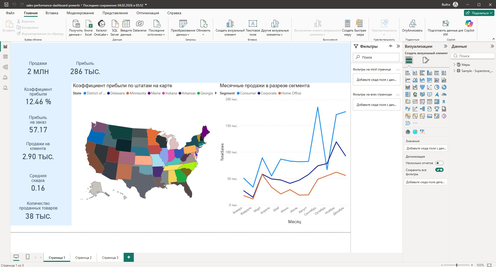
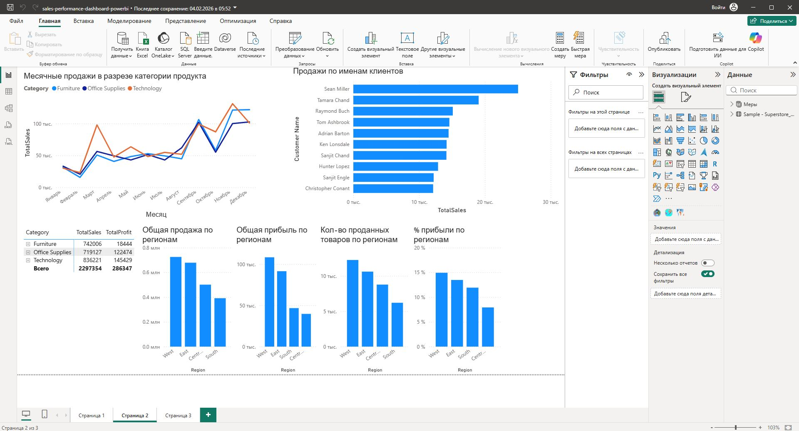
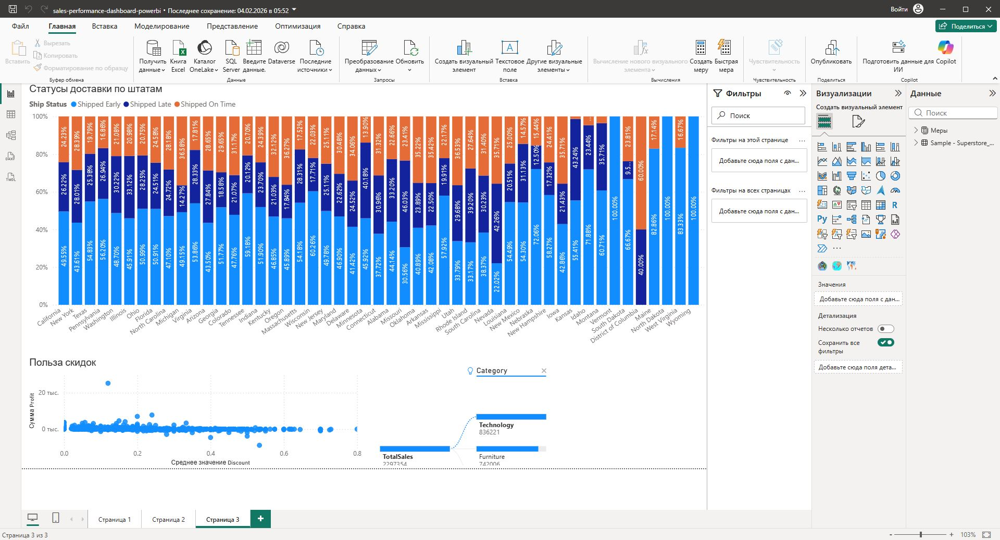

# Sales Performance Dashboard (Power BI)

Interactive business intelligence dashboard built in Power BI for analyzing business performance and key metrics.

## Tools Used
- Power BI
- Power Query
- DAX
- Data Modeling

## Dashboard Features
- Executive KPI overview
- Geographic performance analysis
- Trend analysis
- Interactive filtering
- Business breakdown analysis
- Decomposition tree analysis

## Skills Demonstrated
- Dashboard development
- KPI reporting
- Data transformation
- DAX calculations
- Analytical storytelling
- Business intelligence reporting

## Project Files
- Power BI dashboard (.pbix)
- Dashboard screenshots
## Dashboard Screenshots

